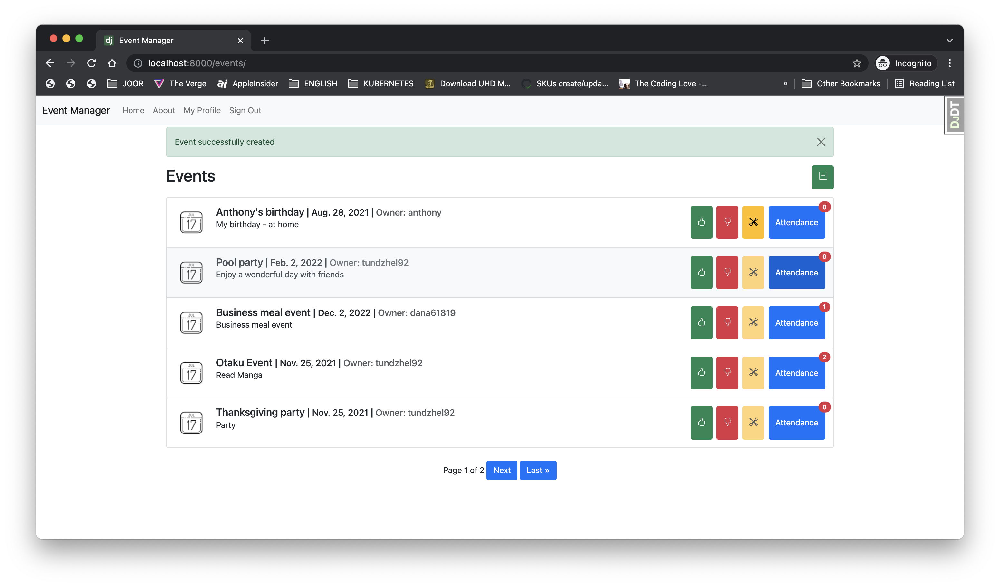

# Event manager



Allows you to list, create and modify events in which all users can see the events but can only edit their own.
All users can sign up or withdraw from an event.

## Building

### Useful commands

Run project locally with Docker
```sh
$ docker-compose -f local.yml build
$ docker-compose -f local.yml up django
```

Run project locally & Debug with ipdb with Docker
```sh
$ docker-compose -f local.yml run --rm --service-ports django
```

Run tests with Docker
```sh
$ docker-compose -f local.yml run --rm django pytest
```

Check tests coverage with Docker
```sh
$ docker-compose -f local.yml run --rm django coverage run -m pytest
$ docker-compose -f local.yml run --rm django coverage report
```
